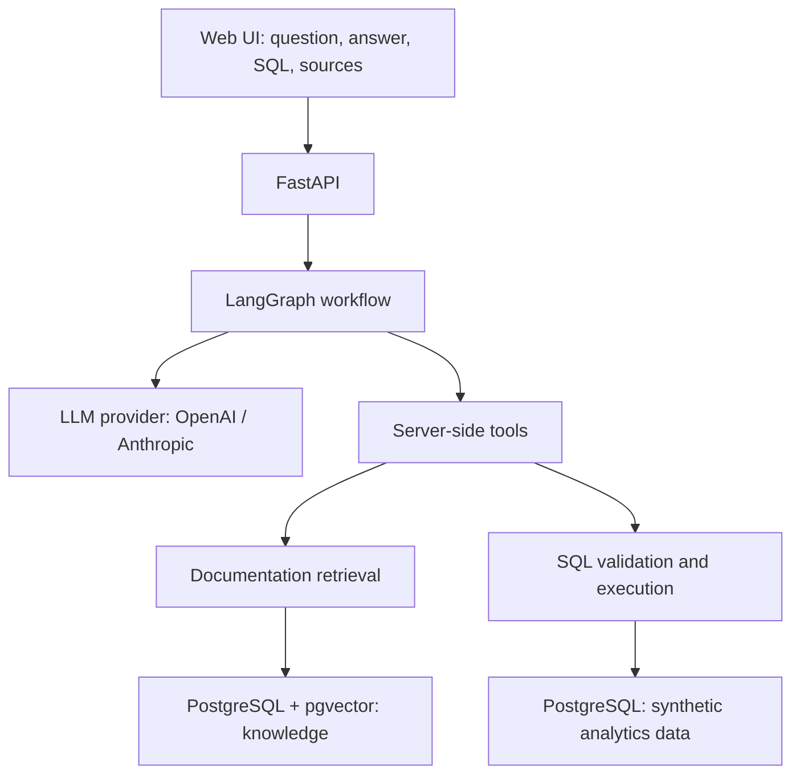
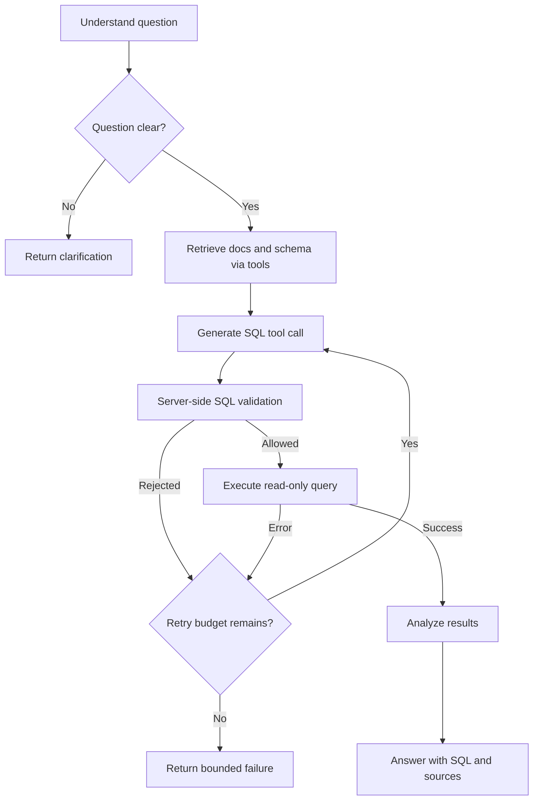

# QueryLens — мета, архітектура та план розробки

Дата створення: 2026-10-04  
Статус: етап 0 завершено й перевірено локально; наступний — schema, roles, seed та knowledge docs.
Призначення документа: основний контекст для спільної розробки через Codex CLI.

## 1. Для чого ми робимо цей проєкт

Зробити невеликий, але завершений AI-продукт, який можна задеплоїти, показати на GitHub та продемонструвати на співбесіді на Backend Engineer / Applied AI Engineer / Backend AI Engineer.

Автор проєкту — Senior Backend Engineer із приблизно 15 роками досвіду. Основний бекграунд: PHP, Yii2, MySQL, ClickHouse, аналітичні звіти на великих наборах даних, Python-сервіси, ETL, фонові воркери та інтеграція результатів ML-моделей. Також є досвід backend для streaming-систем із високим навантаженням.

Проєкт має продемонструвати перехід до **AI-enabled backend systems** через практичний результат: роботу з LLM API, embeddings, RAG, tool calling та керованими агентними workflow. Він розвиває вже наявний досвід роботи з даними, API і базами даних.

Навчальний маршрут:

**FastAPI → OpenAI API → embeddings → pgvector → RAG → tool calling → LangGraph → Docker → deployment.**

Anthropic додаємо як другий провайдер після працездатного основного сценарію.

Головні результати:

- Працюючий demo URL із синтетичними даними.
- Репозиторій із зрозумілим README, архітектурою, тестами та CI.
- Коротке відео або GIF із виконанням аналітичного запиту.
- Реальні приклади для розмови про retrieval, SQL safety, retries, evaluation, observability та витрати на LLM.
- Знання коду й обмежень системи, які автор може сам пояснити на співбесіді.

## 2. Ідея продукту

**QueryLens** — вебсервіс, який відповідає на бізнесові запитання, використовуючи документацію про метрики та дані PostgreSQL.

Користувач запитує:

> Why did revenue drop last week?

Сервіс:

1. Знаходить у документації визначення revenue та правила розрахунку.
2. Отримує доступну схему аналітичних таблиць.
3. Створює SQL через LLM.
4. Перевіряє SQL на сервері.
5. Виконує його через обмежений database tool.
6. За необхідності виправляє помилку й повторює запит у межах ліміту.
7. Аналізує результат і повертає відповідь із SQL, джерелами та обмеженнями висновку.

Приклад формату відповіді, а не наперед визначений результат:

> Revenue decreased by X% compared with the previous week. The largest contribution to the decline came from Germany. This is a breakdown of the observed change; the data does not establish its underlying cause.

**Важлива межа:** агент пояснює внесок сегментів у зміну показника. Не видає кореляцію за доведену причинність. Числа повинні походити з виконаних запитів; приклади в інтерфейсі не можна показувати як живий результат.

### Приклади запитань

- How many new users registered last week?
- Which countries had the highest revenue last month?
- Why did revenue decrease in September?
- What percentage of users who registered in August made a purchase?
- Compare Germany and Poland ARPU for September.
- Which subscription plan had the highest churn rate last month?

Інтерфейс і документація репозиторію — англійською, щоб проєкт було зручно показувати рекрутерам. Обговорення та пояснення під час розробки можуть бути українською.

## 3. Межі MVP v1

### Обов'язково

- FastAPI backend і мінімальний вебінтерфейс.
- Один синтетичний dataset у PostgreSQL.
- Markdown knowledge base з визначеннями метрик, схемою та бізнесовими правилами.
- Ingestion: chunking, embeddings, збереження у pgvector.
- Retrieval релевантних фрагментів документації з ідентифікаторами джерел.
- OpenAI як перший реальний LLM provider.
- Реальний tool calling із серверним виконанням tools.
- LangGraph workflow зі станом, обмеженими циклами та обробкою помилок.
- SQL validation, окрема read-only роль БД, timeout і обмеження результатів.
- Відповідь із таблицею результатів, SQL і використаними джерелами.
- Docker Compose для локального запуску.
- Тести критичних сценаріїв і невеликий evaluation dataset.
- GitHub Actions, README та deployment першого demo.

### Після MVP

- Anthropic provider і перевірка сумісності tools.
- Streaming відповідей і прогресу через SSE.
- Порівняння моделей за якістю, latency та вартістю.
- Удосконалення retrieval: hybrid search, reranking, HNSW за результатами вимірювань.
- Кешування, історія сесій, feedback та більший dataset.
- Розширені multi-step аналітичні запити й графіки.

### Поза початковим scope

- Навчання власної ML-моделі.
- Kubernetes, мікросервіси та складна frontend-архітектура.
- Підключення довільних production-баз відвідувачів.
- Завантаження довільних документів у публічному demo.
- Повноцінний SaaS із billing, організаціями та multi-tenancy.

## 4. Архітектура



У локальному MVP достатньо одного PostgreSQL instance з окремими schemas та ролями. Knowledge storage й аналітичні дані логічно розділені. SQL tool не має доступу до embeddings, внутрішніх логів або секретів.

| Технологія | Роль |
|---|---|
| Python | Backend, ingestion, генерація даних, evaluation |
| FastAPI | API, validation запитів, health endpoints |
| OpenAI API | Перший LLM provider і початковий embedding provider |
| Anthropic API | Другий LLM provider після MVP |
| PostgreSQL | Бізнесові дані та metadata документів |
| pgvector | Зберігання embeddings і vector similarity search |
| RAG | Контекст із business rules, definitions і schema docs |
| Tool calling | Запити моделі до schema, documentation і database tools |
| LangGraph | Стан workflow, transitions, контроль retries і завершення |
| SQLAlchemy + PostgreSQL driver | Підключення до БД та серверний доступ до даних |
| Alembic | Міграції |
| SQLGlot або аналогічний SQL parser | AST-перевірка SQL; конкретний вибір перевірити під час реалізації |
| Docker / Docker Compose | Відтворюване локальне середовище |
| pytest / Ruff / GitHub Actions | Перевірки та CI |
| Мінімальний HTML/JS або React | Простий demo UI |

FastAPI може віддавати простий статичний UI. Next.js для першої версії не потрібен. Остаточні версії пакетів, API моделей, embedding dimensions, доступність хостингу та ціни перевіряємо перед реалізацією відповідного етапу.

## 5. Дані та бізнесова модель

Домен: вигаданий subscription/ecommerce-продукт із користувачами, покупками, сесіями та підписками. Дані повністю синтетичні, без інформації з роботодавця.

### Таблиці analytics schema

| Таблиця | Основні поля |
|---|---|
| `users` | `id`, `country`, `registered_at`, `status` |
| `orders` | `id`, `user_id`, `amount`, `currency`, `created_at`, `status` |
| `events` | `id`, `user_id`, `event_type`, `created_at` |
| `subscriptions` | `id`, `user_id`, `plan`, `started_at`, `cancelled_at` |

Правила:

- Primary/foreign keys та індекси для типових фільтрів за датами, користувачами й країнами.
- Усі timestamps з timezone; аналітичні періоди MVP обчислюються в UTC.
- Грошові значення — `NUMERIC`, а не floating point; у MVP одна валюта EUR.
- Revenue включає тільки `completed` orders; refunded/cancelled не включаються. Це спрощене правило demo, а не універсальна модель бухгалтерського доходу.
- `session` event означає активність користувача.
- Seed відтворюваний: фіксовані random seed та опорна дата.

### Розмір і сценарії

Почати з приблизно 10 тисяч користувачів і 100 тисяч подій/замовлень загалом. Масштабування до приблизно 1 мільйона рядків — наступний етап, якщо воно корисне для демонстрації performance.

Генератор має навмисно створювати відомі сценарії: спад completed purchases в одному сегменті, різницю між країнами, churn за планами. Це дозволить перевіряти правильність відповідей.

Оскільки дані статичні, запити «last week» прив'язуємо до **demo reference date**, а не непомітно до поточної дати сервера. Цю дату показуємо в UI, API та README.

### Однозначні визначення метрик

| Метрика | Визначення MVP |
|---|---|
| Revenue | Сума `amount` для completed orders у заданому періоді |
| Active users | Унікальні користувачі з session event у заданому періоді |
| ARPU | Revenue / кількість active users у тому самому періоді |
| ARPPU | Revenue / кількість унікальних покупців із completed order у періоді |
| Conversion | Частка користувачів із registration cohort, які зробили completed purchase у явно визначеному вікні |
| Subscription churn rate | Підписки, активні на початок періоду й скасовані протягом нього / усі підписки, активні на початок періоду |

Для всіх метрик документуємо знаменник, період, timezone та поведінку при нульовому знаменнику. За відсутності знаменника значення позначається як undefined, а не вигаданий нуль. Якщо період або conversion window неоднозначні — агент уточнює запит.

## 6. Knowledge base та RAG

```text
knowledge/
    metrics.md
    database.md
    business_rules.md
    events.md
```

Приклади вмісту:

```markdown
# Revenue
Revenue includes completed orders only.
Refunded and cancelled orders are excluded.
All monetary values in this demo are in EUR.

# Active users
An active user has at least one session event in the requested period.

# ARPU
ARPU is revenue divided by active users in the same period.
It differs from ARPPU, which uses paying users as its denominator.
```

### Ingestion

1. Зчитати Markdown.
2. Розбити на chunks за headings та обмеженням розміру, з достатнім контекстом.
3. Зберегти `source_path`, heading, chunk id, content hash і версію документа.
4. Отримати embeddings та записати їх у pgvector.
5. Не дублювати незмінені chunks при повторному запуску; видаляти або позначати застарілі.

Ingestion — окрема CLI-команда/job, не операція на кожному startup вебсервера. Модель embeddings і dimensions фіксуються разом із версією індексу. Зміна embedding model потребує reindex.

### Retrieval

1. Отримати embedding запиту сумісною моделлю.
2. Знайти top-K chunks; початково K приблизно 4–6, далі налаштувати за evaluation.
3. Передати текст і source ids до LLM.
4. Повернути використані джерела користувачу.

Почати з exact vector search: для малої knowledge base цього достатньо. HNSW/IVFFlat додаємо лише коли обсяг і заміри виправдовують складність. Retrieval не гарантує, що знайдений документ релевантний: потрібні перевірки якості та поведінка при недостатньому контексті.

## 7. Tools та справжній tool calling

Перші три tools:

```python
get_database_schema()
search_documentation(query: str)
execute_sql(query: str)
```

Модель отримує JSON schemas tools, повертає tool call із назвою й arguments. Backend валідовує arguments, виконує дозволений tool, додає структурований tool result до контексту й продовжує workflow.

Просто попросити модель надрукувати SQL і виконати текст — недостатньо, щоб називати це реалізованим tool calling.

Наступні tools:

```python
get_metric_definition(metric: str)
explain_sql(query: str)
```

`get_metric_definition` може використовувати той самий knowledge retrieval. `explain_sql` початково виконує звичайний `EXPLAIN` після validation; `EXPLAIN ANALYZE` виконує сам запит і потребує тих самих runtime-обмежень.

Tool results містять машинозчитувані поля: status, error category, columns, rows, row count, truncation flag та duration. Database errors очищуються від credentials і внутрішніх деталей.

## 8. LangGraph workflow



Початковий state:

- question і demo reference date;
- messages та tool call ids;
- retrieved chunks і дозволена schema;
- generated SQL, query results та execution trace;
- validation/database errors;
- retry count, tool count, token usage і deadline;
- final answer або clarification.

Початкові ліміти, конфігуровані через settings:

- До 2 SQL-виправлень після першої спроби.
- До 8 tool calls на один запит.
- До 3 успішних аналітичних SQL-запитів на відповідь.
- Загальний request deadline, наприклад 60 секунд, і окремі LLM/DB timeouts.

Ліміти — початкові інженерні рішення; налаштувати їх після вимірювань. Якщо вичерпаний бюджет або контекст недостатній, повертаємо зрозумілу помилку чи уточнення. Агент не повинен циклічно «думати» без завершення.

## 9. SQL safety

LLM створює пропозицію запиту. Backend і PostgreSQL визначають, що можна виконати.

Захист має кілька шарів:

1. **Окрема роль БД:** лише SELECT на дозволених analytics tables/views. Без ownership, запису, DDL чи доступу до knowledge schema. Migration/ingestion credentials не використовуються в SQL tool.
2. **Read-only transaction:** встановлюється серверним кодом, а не за інструкцією моделі.
3. **AST validation:** рівно один query statement. Дозволені SELECT/читальні CTE; заборонені DML, DDL, COPY, SELECT INTO, write CTE та locking clauses.
4. **Allowlist relations і functions:** SELECT також може викликати небезпечні або дорогі функції. Заборонити їх; не покладатися на prefix check чи regex. Перевіряти schema-qualified relations, CTE aliases та nested queries.
5. **Runtime timeout:** початково `statement_timeout = 5s`, короткий lock timeout і загальний deadline запиту.
6. **Обмеження результату:** до 1000 рядків плюс byte/token budget; явно показувати, якщо результат обрізано. LIMIT/обгортку застосовувати через parser без небезпечного склеювання рядків. Row limit не замінює timeout.
7. **Контекст:** лише синтетичні дані та необхідний tool output; не передавати LLM credentials.

Prompt injection із документів або tool output розглядаємо як недовірені дані. Інструкції з retrieved text не можуть змінити permissions або набір доступних tools. Реальні гарантії забезпечують серверні перевірки та роль БД.

Для публічного demo: server-side API keys, rate limit, обмеження parallel requests, довжини input і витрат. Не робити довільне підключення чужої БД у MVP.

## 10. LLM provider abstraction

Спільний інтерфейс має представляти повідомлення, tool schemas, tool calls, usage та помилки. API-повідомлення різних провайдерів нормалізуються адаптерами.

```python
class LLMProvider(Protocol):
    async def generate(
        self,
        messages: list[Message],
        tools: list[ToolSpec],
    ) -> LLMResult:
        ...
```

Спочатку реалізувати один `OpenAIProvider`, використовуючи актуальний Responses API після перевірки офіційної документації. Потім додати `AnthropicProvider` з тим самим прикладним контрактом.

```env
LLM_PROVIDER=openai
LLM_MODEL=<supported-model>
EMBEDDING_PROVIDER=openai
EMBEDDING_MODEL=<supported-embedding-model>
OPENAI_API_KEY=<server-side-secret>
ANTHROPIC_API_KEY=<optional-server-side-secret>
```

LLM provider та embedding provider — різні налаштування. Перемикання chat provider не повинно автоматично змінювати векторний простір knowledge base. Спочатку ручний вибір provider; автоматичний fallback — окрема функція з чіткою політикою retries і витрат.

## 11. API та вебінтерфейс

### Початкові endpoints

| Endpoint | Призначення |
|---|---|
| `GET /health/live` | Процес працює |
| `GET /health/ready` | БД, міграції та knowledge index готові |
| `GET /api/demo` | Reference date, доступний період даних, приклади запитань |
| `POST /api/chat` | Виконати один аналітичний запит |

У v1 запити незалежні: не обіцяємо збережену multi-turn memory. Conversation sessions — наступне розширення.

Приклад request:

```json
{"question": "Which countries had the highest revenue in September?"}
```

Структура response: request id, status (`answered`, `needs_clarification`, `failed`), answer, executed queries, result tables, sources, warnings та timing. Поля конкретизувати під час реалізації.

### UI

- Заголовок QueryLens.
- Позначення «Synthetic demo data», дата та валюта.
- Поле запитання і 5–6 example prompts.
- Відповідь, таблиця результатів, View SQL і Sources.
- Короткий execution trace: retrieved docs, validated SQL, executed query.
- Видимі loading, clarification, timeout, empty result і truncation states.

Trace показує дії інструментів та їх результати, а не прихований chain-of-thought моделі. Для v1 достатньо JSON response; SSE додати після стабільного end-to-end сценарію.

## 12. Орієнтовна структура репозиторію

```text
querylens/
├── app/
│   ├── api/
│   │   ├── chat.py
│   │   ├── health.py
│   │   └── schemas.py
│   ├── agents/
│   │   ├── graph.py
│   │   ├── nodes.py
│   │   └── state.py
│   ├── llm/
│   │   ├── base.py
│   │   ├── openai.py
│   │   └── anthropic.py
│   ├── rag/
│   │   ├── embeddings.py
│   │   ├── ingestion.py
│   │   └── retrieval.py
│   ├── tools/
│   │   ├── database.py
│   │   ├── sql_validation.py
│   │   ├── schema.py
│   │   └── documentation.py
│   ├── db/
│   │   ├── models.py
│   │   └── connection.py
│   ├── static/
│   ├── config.py
│   └── main.py
├── knowledge/
├── migrations/
├── scripts/
│   ├── seed_demo.py
│   ├── ingest_knowledge.py
│   └── evaluate.py
├── evals/
├── tests/
├── docs/
├── .github/workflows/ci.yml
├── .env.example
├── .gitignore
├── Dockerfile
├── docker-compose.yml
├── pyproject.toml
├── README.md
└── QUERYLENS_PLAN.md
```

Структура — орієнтир, не вимога створити всі порожні файли одразу. `anthropic.py` з'являється, коли реалізуємо другого провайдера. Додаємо lockfile обраного package manager, коли фіксуємо dependencies.

## 13. План розробки та acceptance criteria

### Етап 0 — skeleton і локальне середовище

- Створити репозиторій, Python project, settings та `.env.example`.
- FastAPI з health endpoint.
- Dockerfile та Compose: API + PostgreSQL із pgvector.
- Міграції запускаються окремою командою.

**Готово, коли:** clean checkout можна запустити за README; health працює; БД доступна; секрети й `.env` не потрапляють у Git.

### Етап 1 — schema, seed та knowledge docs

- Analytics tables, roles, grants та індекси.
- Seed generator із фіксованою датою та відомими сценаріями.
- Документація метрик і контрольні SQL-запити.

**Готово, коли:** seed відтворюваний, контрольні метрики перевірені, read-only роль не може змінити дані.

### Етап 2 — database tools і SQL validation

- Доступна schema metadata.
- AST validation, relation/function allowlists.
- Read-only execution, timeout, row/byte limits, structured errors.

**Готово, коли:** коректні SELECT/CTE працюють; небезпечні запити відхиляються; integration tests перевіряють permissions і timeout у PostgreSQL.

### Етап 3 — embeddings та RAG

- Ingestion Markdown chunks у pgvector.
- Idempotent re-ingestion і source metadata.
- Search documentation tool.

**Готово, коли:** запити про revenue, ARPU і churn знаходять правильні definitions; повторний ingestion не дублює дані; результат містить джерела.

### Етап 4 — перший LLM provider і tool calling

- OpenAI adapter зі структурованими tool calls.
- Dispatch трьох tools і повернення results моделі.
- Timeouts, usage tracking та нормальна обробка API-помилок.

**Готово, коли:** один end-to-end запит отримує definition/schema, виконує дозволений SQL і відповідає фактичними даними. Offline tests використовують stub provider; live smoke test запускається окремо.

### Етап 5 — LangGraph orchestration

- State, nodes, conditional transitions.
- Clarification, bounded repair loop, deadline та tool budget.
- Trace й завершення при unsupported question.

**Готово, коли:** правильний запит, SQL error, ambiguous question і exhausted retry budget завершуються передбачувано.

### Етап 6 — demo UI

- Запитання, example prompts, answer, results, SQL і sources.
- Reference date, synthetic data label та error states.

**Готово, коли:** повний сценарій можна показати в браузері без ручних API-запитів.

### Етап 7 — evaluation, CI та observability

- Приблизно 15–20 контрольних запитань.
- Structured logs: request id, provider/model, latency, tool/SQL attempts, tokens.
- CI: lint, unit tests, database integration tests із синтетичними даними.
- Estimated cost за usage і явно версіонованим pricing config, якщо додаємо показник вартості.

**Готово, коли:** evaluation звіт показує кількість кейсів, правильність метрик, retrieval quality і failures; CI проходить; secrets не логуються.

### Етап 8 — deployment і README

- Вибрати хостинг за перевіреними можливостями та бюджетом.
- Налаштувати HTTPS, managed PostgreSQL із pgvector або контрольований Docker deployment.
- Запустити міграції, seed та ingestion як окремі deploy tasks.
- Server-side secrets, rate/concurrency limits і бюджет публічного demo.
- README, architecture diagram, screenshots/GIF і demo URL.

**Готово, коли:** deployment працює, перезапуск не втрачає дані, 5 основних prompts перевірені на deployed версії, помилки й ліміти показуються коректно.

### Етап 9 — v1.1: Anthropic і покращення

- Anthropic adapter та спільні provider contract tests.
- Порівняння якості на тих самих eval cases.
- SSE, додаткові tools і performance work — за потребою.

**Готово, коли:** перемикання provider не потребує зміни бізнесової логіки, а підтримка другого provider підтверджена реальним smoke test.

## 14. Як перевіряти якість

Не порівнювати лише SQL strings: різні запити можуть дати однаковий правильний результат.

Для кожного eval case зберігати question, reference date, потрібні definitions, очікувані значення/таблиці або еталонний SQL та допустимі похибки.

Обов'язкові сценарії:

- Revenue excludes refunded/cancelled orders.
- ARPU та ARPPU мають різні знаменники.
- Межі дат, zero denominator та empty result.
- SQL repair після одного database error.
- Відхилення multi-statement, write CTE, SELECT INTO і недозволених functions/relations.
- Prompt injection не змінює permissions.
- Невідоме поле чи недостатня документація не породжують вигадані дані.
- Бюджет tools/retries і deadline завершують workflow.
- Числа у фінальній відповіді відповідають query results.

Offline CI має бути відтворюваним і не потребувати платних API keys. Live evaluation — окрема команда з явним бюджетом. Синтетичні evals доводять якість лише для перевірених сценаріїв, а не універсальну точність агента.

## 15. Deployment та витрати

Можливі кандидати: Render, Fly.io, Railway або невеликий VPS із Docker Compose. Це варіанти для перевірки, не вже обраний хостинг. Перед вибором звірити підтримку pgvector, persistence, memory, secrets, backups і актуальні ціни.

Для одного розробника достатньо одного API service та PostgreSQL. Якщо хостинг має обмеження idle/sleep або cold start, описати це в README.

Контроль витрат:

- Embeddings рахувати під час ingestion, не на кожному startup.
- Обрізати tool results за rows і bytes.
- Обмежити довжину запитання та контексту.
- Rate limit перевіряти на сервері; глобальний budget має працювати між усіма workers.
- На вичерпання бюджету показувати явне повідомлення; резервний recorded demo позначати як recorded.

## 16. Що показати в README та на співбесіді

Початок README:

> QueryLens answers business questions using documentation retrieval, LLM tool calling and read-only SQL execution over synthetic PostgreSQL data.

README має містити:

- Demo URL і GIF/коротке відео.
- Приклади запитань та screenshot answer + SQL + sources.
- Architecture diagram і реальний tool workflow.
- Local quickstart: dependencies, env, migrations, seed, ingestion, run.
- Definitions метрик і reference date.
- SQL safety, budget limits та відомі обмеження.
- Команди тестів/evaluation та результати із зазначенням model/version.
- Пояснення рішень: чому pgvector, LangGraph і окремий read-only tool.

Приклад майбутнього CV bullet, **лише після реалізації та deployment зазначених можливостей**:

> Built and deployed QueryLens using FastAPI, LangGraph, PostgreSQL/pgvector and LLM APIs. Implemented documentation retrieval, tool calling, read-only SQL validation, bounded recovery workflows and evaluation against synthetic business datasets.

Якщо реалізований тільки OpenAI, не заявляти підтримку Anthropic. Конкретні performance/accuracy цифри додавати лише після вимірювань із описаною методикою.

Demo сценарій на 2–3 хвилини:

1. Просте запитання про revenue за період.
2. Показати виконаний SQL, таблицю та definition із knowledge base.
3. Порівняти сегменти, пояснивши межі висновку.
4. Показати один controlled failure або clarification.
5. Відкрити архітектуру, SQL safety та evaluation results.

## 17. Як працювати з цим документом у Codex CLI

Покласти файл у корінь репозиторію. На початку нової сесії попросити Codex прочитати його та поточний код. Документ описує задум, але виконані можливості потрібно підтверджувати реалізацією й перевірками.

### Промпт для старту

```text
Прочитай QUERYLENS_PLAN.md і правила репозиторію.
Ми створюємо цей pet-проєкт для мого портфоліо Backend / Applied AI Engineer.
Почни з етапу 0: Python skeleton, FastAPI, settings, health endpoint,
Dockerfile, Docker Compose з PostgreSQL/pgvector, .env.example і README.
Спочатку оглянь поточні файли, потім реалізуй етап і перевір запуск.
Не створюй заглушки для всіх майбутніх модулів.
Пояснюй важливі рішення українською, а код і README пиши англійською.
Наприкінці онови checklist і handoff у цьому документі.
```

### Промпт для продовження

```text
Прочитай QUERYLENS_PLAN.md, правила репозиторію та поточний код.
Перевір checklist і handoff, визнач наступний незавершений етап.
Реалізуй його, виконай відповідні перевірки та онови статус.
Коротко поясни зміни, як запустити/перевірити результат і що лишилося.
```

### Правила спільної розробки

- Один завершений milestone за раз із демонстрацією результату.
- Пояснювати нові AI-концепції через реалізований код.
- Зберігати просту структуру; abstractions додаються за реальною потребою.
- Не додавати credentials у код, Git, README чи logs.
- Не називати mocked response реальною інтеграцією.
- Не позначати deployment готовим без live smoke test.
- Оновлювати план, якщо рішення змінились, і записувати причину.
- Звичайне «продовжуй» означає наступний етап із checklist, а не переробку всього проєкту.

### Checklist

- [x] Етап 0: skeleton, Docker, FastAPI, settings.
- [ ] Етап 1: schema, roles, seed, knowledge docs.
- [ ] Етап 2: SQL validation і database tools.
- [ ] Етап 3: embeddings, ingestion, retrieval.
- [ ] Етап 4: OpenAI і справжній tool calling.
- [ ] Етап 5: LangGraph, retries, deadlines, trace.
- [ ] Етап 6: usable web UI.
- [ ] Етап 7: evaluation, CI, observability.
- [ ] Етап 8: deployed demo і portfolio README.
- [ ] Етап 9: Anthropic та обрані v1.1 improvements.

### Handoff — оновлювати після кожної сесії

- **Останній завершений етап:** етап 0 — 2026-10-06, skeleton і локальне середовище.
- **Поточний стан:** є uv project і lockfile, settings, FastAPI `/health/live` та `/health/ready`, Alembic із міграцією pgvector, Dockerfile з non-root користувачем, Compose з окремим migration job, README та тести. На запит користувача локальне Python-середовище й Docker переведено на Python 3.14.8; оновлено `.python-version`, Python requirement, Ruff target, lockfile і документацію. Локальні `querylens-api-1` і `querylens-db-1` працюють: API `http://127.0.0.1:8000`, БД `127.0.0.1:5433`. Створено ignored `.env` із випадковим локальним паролем; `.env` не включено до Docker-образу. Етап 0 зафіксовано комітом `a81f9c6` (`feat: add FastAPI and PostgreSQL development environment`). Перехід на Python 3.14.8 зафіксовано окремим локальним комітом `chore: upgrade Python to 3.14.8`; push цього переходу ще не виконано.
- **Що перевірено:** мережа та Docker daemon доступні після зміни дозволів; `uv lock --check`, `uv sync --locked`, Ruff lint/format, 13 offline тестів і 1 PostgreSQL integration test (разом 14 passed). Docker build та README quickstart перевірено в окремій свіжій копії файлів із новим volume. До міграції readiness — 503, після — 200. Реальна vector distance дорівнює 0 для однакових векторів, sessions використовують UTC. При зупиненій БД liveness — 200, readiness — 503; після відновлення БД readiness — 200. Після `compose down` і повторного створення контейнерів без міграцій revision і pgvector збережені. Тимчасові verification containers/volume видалено; основне локальне середовище залишено запущеним. Git і Docker ignore-файли виключають `.env` та локальне середовище.
- **Перевірки переходу на Python 3.14.8 — 2026-10-06:** `uv sync --locked`, `uv lock --check`, Ruff lint/format та всі 14 тестів із реальною PostgreSQL integration перевіркою пройшли на новому Python. Локальний Alembic `upgrade head` і `current` успішні. Docker build і `docker compose up --build -d --wait api` успішні; API-контейнер підтвердив Python 3.14.8, migration job завершився успішно, `/health/live` та `/health/ready` повернули 200. Обидва основні контейнери healthy. Версії всіх залежностей у lockfile збережено; видалено непотрібні artifacts для попередніх версій Python.
- **Наступна дія:** етап 1 — analytics tables, окремі roles/grants, відтворюваний seed із demo reference date, knowledge docs і контрольні метрики. Повідомлення комітів — англійською.
- **Відкриті рішення:** обрано uv, Python 3.14.8, SQLAlchemy 2.0 і psycopg2; синхронні DB health checks виконуються в пулі потоків FastAPI. Початкову Python 3.12 замінено на 3.14 на запит користувача після розблокування мережі й перевірки сумісності; точну 3.14.8 зафіксовано локально й у Docker, мінімальна вимога проєкту — 3.14. Для завантаження 3.14.8 використано тимчасовий uv 0.12.23, оскільки встановлений глобально uv 0.11.16 ще не знав цей patch release; глобальний uv не змінювали. Docker і README використовують uv 0.12.23. Сумісні patch versions зафіксовано в `uv.lock` (FastAPI 0.136.3, SQLAlchemy 2.0.54, Alembic 1.20.0, psycopg2-binary 2.9.13). Dev TestClient використовує HTTPX2 за актуальною документацією Starlette. Docker: PostgreSQL 17 / pgvector 0.8.6. LLM models, embedding dimensions, demo reference date, hosting і бюджет ще не обрано. Knowledge-index readiness буде додано на етапі ingestion.
- **Блокери:** для етапу 1 немає. Для першої live LLM/embedding інтеграції потрібен server-side API key; поточний етап його не потребував. SQL tool і окрема read-only роль ще не реалізовані — це наступні етапи; локальна owner роль використовується лише для міграцій та health checks.

## 18. Перший цільовий результат

Після етапів 0–6 користувач відкриває локальний UI, ставить аналітичне запитання, система знаходить definitions, виконує перевірений read-only SQL і показує відповідь із SQL та sources.

Після етапів 7–8 той самий сценарій доступний за demo URL, має перевірену якість на контрольних прикладах і документований репозиторій для портфоліо.
