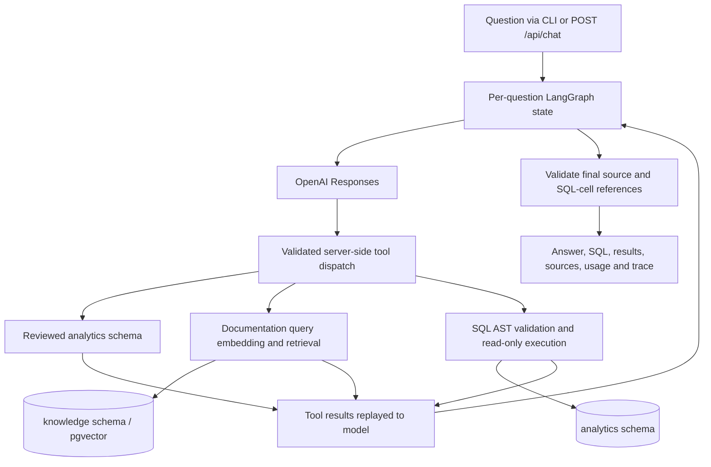

# Architecture and development context

[Documentation index](README.md)

QueryLens answers business questions over a controlled synthetic PostgreSQL
dataset. Metric definitions come from repository Markdown; the model proposes tool
calls and SQL, while the backend and database enforce what can execute. Answers
include executed SQL/results, definition sources, actual usage and local trace.

## Current scope

Stages 0–5 are implemented: API foundation, deterministic analytics, dedicated
roles, AST-validated SQL, versioned ingestion/retrieval, OpenAI Responses tool
calling and bounded LangGraph orchestration. Stage 5 local/offline/PostgreSQL and
live regression evidence is recorded in [verification.md](verification.md#stage-5).
The next milestone is a minimal UI served by FastAPI, showing questions, answers,
SQL/results, sources, errors, the demo reference date and the synthetic-data label.
Evaluation/CI/observability and deployment follow the UI. No demo is deployed yet.

## Request and data flow

One PostgreSQL instance has separate `analytics` and `knowledge` schemas.
Seed generation, migrations, role provisioning and ingestion are explicit jobs.
Startup and health checks do not call providers or load data. Health readiness
checks database/migrations/pgvector; retrieval separately checks index compatibility.

## Trust boundaries and correctness

Generated SQL, user text, retrieved documents and tool output are untrusted.
Only three declared tools are available. Provider arguments cannot choose roles,
credentials, models, index names, deadlines or limits. Analytics SQL uses a
SELECT-only role and server-controlled read-only transactions after AST validation;
knowledge uses a separate reader, and ingestion a separate writer.
See [SQL policy](sql-tool.md) and [role permissions](data.md#database-roles).

The synthetic-v1 time anchor is 2026-10-01 UTC, independent of server time. Money
is NUMERIC/EUR. Revenue includes completed orders only; ARPU uses active users,
ARPPU paying users, with explicit windows and undefined missing denominators.
Definitions and reference values are in [data.md](data.md).

The backend inserts actual SQL-cell values into final facts and validates source
IDs. This establishes provenance, not semantic correctness of SQL, labels or prose.
Segment contributions do not establish causality. Deadlines are cooperative;
returned-byte limits are not database memory/work limits. Per-process concurrency
is not a shared deployment rate or spending limit. Broader semantic evaluation
and deployment controls belong to later milestones.

## Module map

| Path | Responsibility |
|---|---|
| [`app/main.py`](../app/main.py), [`app/api/`](../app/api) | FastAPI lifecycle, health/demo/chat routes |
| [`app/config.py`](../app/config.py) | Validated settings and separate credentials/provider budgets |
| [`app/db/`](../app/db) | Analytics metadata and foundation connections |
| [`app/tools/`](../app/tools) | Reviewed schema, AST policy, bounded SQL execution, validated dispatch |
| [`app/rag/`](../app/rag) | Markdown chunking, embeddings, versioned indexes, atomic ingestion and retrieval |
| [`app/llm/`](../app/llm) | Responses adapter, prompt/contracts, per-question graph and answer grounding |
| [`migrations/`](../migrations) | Explicit schema changes |
| [`scripts/`](../scripts) | Admin jobs, seed/control queries, ingestion/search/chat and live checks |
| [`knowledge/`](../knowledge) | Business definitions ingested into pgvector |
| [`tests/`](../tests) | Offline contracts and real PostgreSQL integration checks |
| [`docs/`](.) | Contributor guides and verification evidence; outside the default retrieval corpus |

## Development decisions

Keep the structure small and work on one milestone at a time. Read the relevant
source and tests after these guides; code and actual checks establish behavior.
Follow [`AGENTS.md`](../AGENTS.md) for repository working rules and the optional
local plan for the author's checklist/handoff. The plan is Git-ignored and is not
required in clones; do not copy or commit it into `docs/`.

Keep offline tests deterministic and independent of paid keys. PostgreSQL proves
SQL permissions/timeouts and vector behavior; mocks alone do not. Live acceptance
is separate and requires an explicit budget. Update the relevant guide when
behavior or commands change, and append actual checks to the verification record.

SQLGlot is exactly pinned; parser upgrades need policy/generated-SQL review.
Embedding provider/model/dimensions and index/chunker versions travel with the
index; changes require explicit reindex. LLM settings stay independent. Verify
current official API docs, package compatibility and pricing when making a new
provider/dependency/hosting decision. Existing dated estimates are historical.

There is no checkpoint persistence, streaming, session history or external tracing.
LangSmith tracing is explicitly disabled. Arbitrary external database connections,
public uploads, additional providers, billing, Kubernetes and microservices are
outside the current MVP scope.

## Stack

- Python 3.14.8 and uv with dependencies pinned in `uv.lock`.
- FastAPI and Uvicorn.
- SQLAlchemy 2.0 and psycopg2 for PostgreSQL connections.
- Alembic for explicit database migrations.
- SQLGlot 30.21.0 for a fail-closed PostgreSQL AST policy.
- OpenAI SDK 3.26.0 for embeddings and Responses; pgvector Python 0.5.0 for vector types.
- LangGraph 1.2.14 for sequential workflow orchestration; no checkpoint persistence.
- PostgreSQL 17 with pgvector 0.8.6, running in Docker Compose.
- pytest, HTTPX2, and Ruff for local checks.

Database health checks are synchronous FastAPI endpoints, executed in its worker
thread pool. The database engine is created during application lifespan and
disposed on shutdown. Startup does not connect to the database or run migrations.
