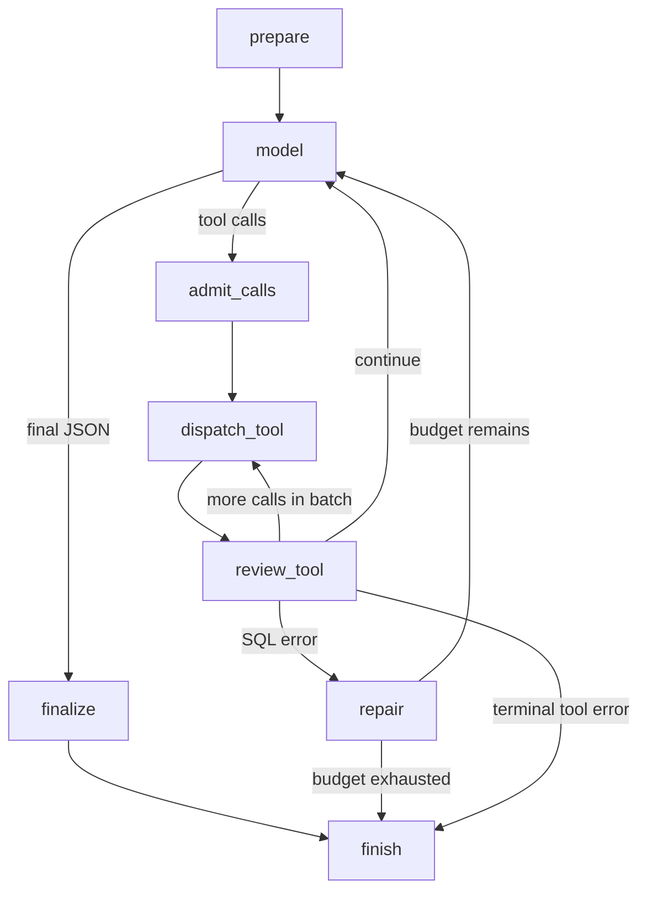

# Chat, Responses and LangGraph

[Documentation index](README.md)

The adapter follows the official [function-calling guide](https://developers.openai.com/api/docs/guides/function-calling)
and [structured-output guide](https://developers.openai.com/api/docs/guides/structured-outputs).
The configured [gpt-5.4-mini model](https://developers.openai.com/api/docs/models/gpt-5.4-mini)
supports Responses, function calling and structured outputs. Documentation was checked
on 2026-10-07; local live revenue acceptance passed on 2026-10-08.
See [verification evidence](verification.md#stage-5) for the LangGraph regression.

The backend declares exactly three strict JSON function schemas:
`get_database_schema`, `search_documentation`, and `execute_sql`. OpenAI returns
`function_call` items; the server validates arguments with Pydantic and dispatches
only those names. Tools execute sequentially even if a response requests several.
Matching `function_call_output` items go back to the model, together with prior
output items, including reasoning when present. Requests use `store=False`, no
conversation IDs, no streaming, `reasoning.effort=none`, explicit timeouts, and
zero SDK retries. No provider call happens during web startup or health checks.

SQL requires successful schema and documentation tools first. Tool arguments cannot
choose roles, credentials, model, index, deadlines or limits. Chat SQL results are
limited to at most 50 rows and 12000 bytes, retaining any stricter SQL settings.
Final answers contain explanation, source IDs and facts referencing a successful
query ID and zero-based row/column. The server validates the references and inserts
actual cell values, preserving Decimal money strings and undefined NULLs. Numeric
claims in model prose are rejected; arithmetic must happen in SQL. Responses also
include executed SQL/results, source content/citations, sanitized trace, usage,
demo reference date and truncation warnings. Reference checks establish value
provenance; they do not prove that SQL, fact labels or prose correctly interpret a
question. Broader semantic evaluation belongs to the evaluation milestone.

After migrations, role provisioning, seed and **real ingestion**:

Open the [web UI](http://127.0.0.1:8000/) to ask through the browser, or use the CLI:

```bash
uv run --locked python -m scripts.ask 'What was revenue last month, in EUR?'
# Or:
docker compose run --rm ask python -m scripts.ask 'What was revenue last month, in EUR?'
```

The non-streaming endpoint is available in `/docs`:

```bash
curl --fail http://127.0.0.1:8000/api/chat \
  -H 'Content-Type: application/json' \
  -d '{"question":"What was revenue last month, in EUR?"}'
```

The API accepts only a question of up to 2000 UTF-8 bytes. It allows one active chat
per process and returns HTTP 429 for another concurrent request. A tool/provider
failure returns a structured `status=error` result; clarification, unsupported
questions and insufficient context are separate statuses. CLI exits nonzero on
error. SQL attempts include repairs, so three attempts allow at most two repairs
after the initial query. Deadlines are cooperative and cannot guarantee a hard network wall-clock cutoff. In-memory
concurrency limits are not a shared deployment rate/cost budget.

Explicit paid acceptance uses one revenue question and checks actual reference
value `336080.07`, schema/retrieval/SQL tools and the revenue source:

```bash
uv run --locked python -m scripts.verify_tool_calling --live
# Or:
docker compose run --rm verify-tool-calling
```

It requires a compatible ingested index and never replaces OpenAI with a stub.
It caps cumulative request bytes at 40000 and total output at 2000 tokens.
The documented model prices on 2026-10-07 are $0.75/M input and $4.50/M output:
a conservative input-byte/token estimate is $0.039 for Responses, plus small-model
query embeddings at most $0.00032. Adding the separate retrieval smoke budget
($0.005) estimates under $0.05 overall. This is not an account billing limit;
reported provider usage is authoritative and failed requests may have unknown usage.
Verified live usage is recorded in [verification.md](verification.md).
Ordinary chat uses the larger configured budgets.
Model aliases can change; changing the LLM does not change the embedding index.

## LangGraph workflow

`app/llm/workflow.py` compiles a sequential `StateGraph` for each question.
State holds the question, demo reference date, message replay, tool IDs, schema,
retrieved sources, SQL results, counters, deadline and final answer. Provider and
database clients and credentials stay outside state. There is no checkpointer,
conversation history or streaming. The Responses adapter and SQL safety policy
remain the same; LangGraph controls the transitions between their calls.



Every node checks the cooperative request deadline. Call admission rejects
duplicate IDs and batches exceeding the remaining tool budget before dispatch.
SQL errors are returned to the model for repair, capped by both the repair limit
and the total SQL-attempt limit. Exhaustion returns `sql_retry_budget_exhausted`
or `sql_budget_exhausted` without another model request. Authentication, index
compatibility and unavailable-service errors terminate instead of retrying.
Provider errors have no automatic retries. An independent 64-step graph guard
returns `workflow_step_limit` if the graph cannot terminate within that bound.

Final JSON can request clarification, report an unsupported question or missing
context, or supply grounded facts. These decisions are model outputs validated
by the backend; the graph does not establish their semantic correctness. The
existing fact/source validation runs in `finalize`, and `finish` returns either
the validated answer or a sanitized failure with evidence collected so far.

Results add `workflow` counters and `workflow_trace` node transitions, durations
and error categories alongside the existing tool `trace`, SQL and actual usage.
Only this local trace is returned. LangSmith tracing is explicitly disabled for
the graph even if enabled by shell environment variables; `langsmith` is a direct
dependency for that switch. No external tracing service is configured.

The four acceptance paths (correct question, SQL repair, ambiguous question and
exhausted retries) run without paid API requests:

```bash
uv run --locked pytest tests/test_workflow.py -q
QUERYLENS_INTEGRATION=1 uv run --locked pytest tests/test_llm_integration.py -q
```

The first uses labeled stub providers/results. The second uses real PostgreSQL,
pgvector, the SDK with offline HTTP transport and labeled stub embeddings.
`scripts.verify_tool_calling --live` additionally checks that the live revenue
answer runs through LangGraph; it still requires an explicit paid-test budget.
